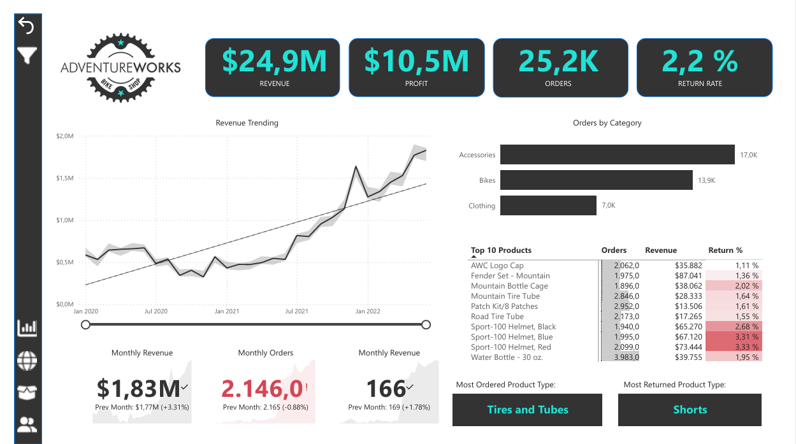
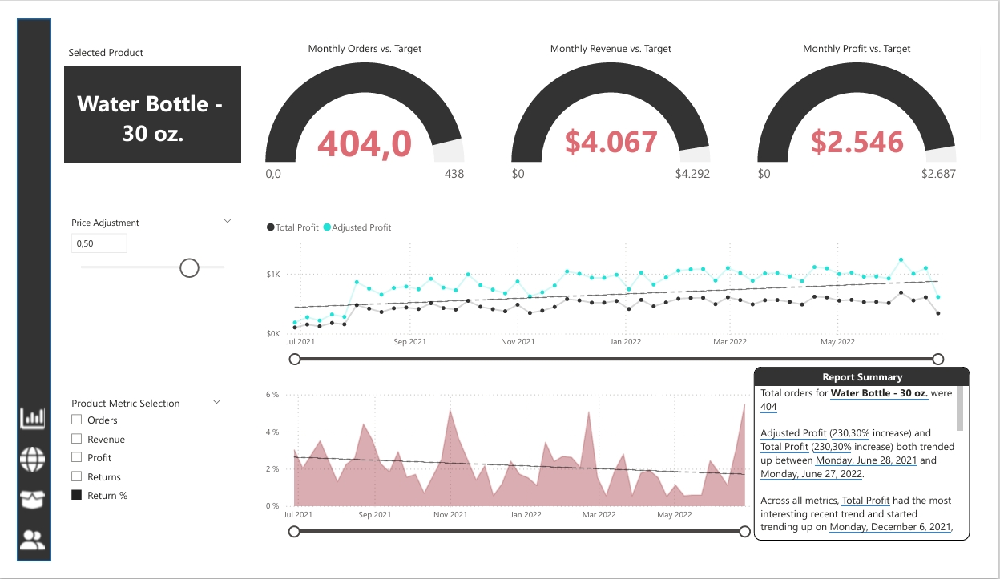
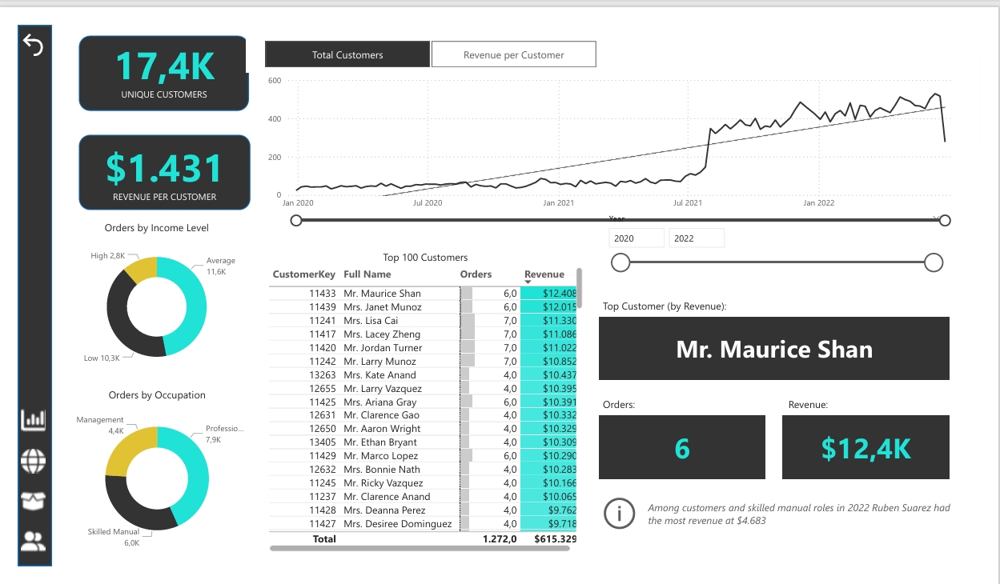
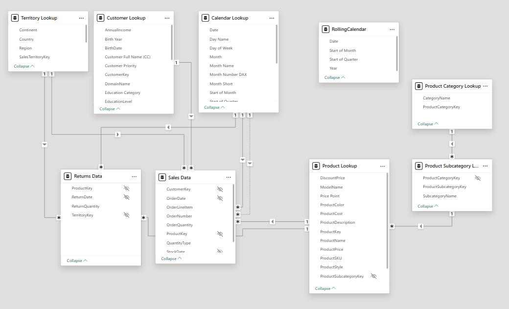

# Power BI Project – AdventureWorks Sales Dashboard

## Project Overview
This project showcases an end-to-end Business Intelligence (BI) workflow using **Power BI Desktop**.  
The goal is to transform raw business data into meaningful, interactive dashboards that support **data-driven decision-making**
(to uncover trends in product performance, customer behavior, and geographic markets, and derive actionable recommendations for business improvement).

This project simulates real-world tasks such as:
- Connecting and transforming datasets using **Power Query**
- Building a **relational data model** with fact and dimension tables
- Creating **measures and calculations** using **DAX**
- Designing **interactive dashboards** with KPIs, slicers, and custom visuals

The project is based on the *AdventureWorks* dataset — a fictional company specializing in manufacturing and selling bicycles and related products.

---

## Key Learning Objectives
- Apply the complete **data analytics lifecycle**: data preparation → modeling → visualization.
- Build efficient **Power Query transformations** for data cleaning and integration.
- Develop **DAX measures** for advanced business metrics (e.g., revenue growth, regional trends, customer segmentation).
- Design professional **report pages** for management and operational insights.
- Implement **data storytelling principles** for clarity and business relevance.

---

## Dashboard Features
- **Executive Overview** – KPIs for total sales, profit margin, and year-over-year performance  
- **Regional Insights** – Comparative analysis by country or sales territory  
- **Product Analysis** – Identify top-performing categories and individual products  
- **Customer Analysis** – Segment customers by value and purchasing behavior  
- **Time Intelligence** – Monthly and quarterly performance trends  

  
  

  
  

---

## Data Model
The project follows a **Star Schema** with clear separation between fact and dimension tables:

- **Sales Data** – Transaction-level sales data (fact)
- **Returns Data** – Data concerning order returns (fact) 
- **Customer Lookup** – Customer information (dim)
- **Product Lookup** – Product catalog (dim)
- **Product Category Lookup** - Product categories (dim)
- **Product Subcategory Lookup** - Product subcategories (dim)
- **Calendar Lookup** – Calendar table for time intelligence (dim) 
- **Territory Lookup** – Regional and country hierarchy (dim) 

---

## Key Insights
1. Product Performance
- Accessories have the highest sales volume but rank only second in revenue and profit due to lower prices.
- Bikes generate the highest revenue and profit thanks to significantly higher average prices.
- Clothing is the weakest category in both revenue and profit.
- Return rates:
  - Bikes: 3.1% (highest)
  - Accessories: 2.0%
  - Clothing: 2.2%
- The Mountain-200 bike is the top-performing product across sales and revenue.
  
2. Geographic Insights
- United States is the strongest market.
- Australia and Canada follow with moderate sales.
- Growth potential identified in the Asia-Pacific region.
  
3. Time Series Trends
- All product categories show steady growth in revenue and profit over time.
- A significant revenue dip for Bikes (Aug 2020 – Sep 2021) indicates potential supply chain issues, seasonality, or pricing changes.
  
4. Customer Segmentation
- Largest segment: middle-income customers (11.6k).
- Low-income segment: 10.3k customers.
- High-income segment is much smaller with 2.8k customers.
- After August 2021, customer count increased 5×, coinciding with the expansion beyond Bikes to Accessories & Clothing.
- Top customers (> $10k) generate high value with only 4–7 orders → likely premium bike buyers.
- High-frequency customers (~25 orders) contribute very little profit (~$1.5k each), indicating purchases of mainly low-priced items.

---
  
## Recommendations for AdventureWorks
1. Reduce Bike Return Rates
- Investigate reasons for returns (model, size, quality expectations).
- Improve product descriptions, sizing guides, and add comparison tools.
- Collect and analyze customer feedback more systematically.
  
2. Increase Value from Low-Priced Categories
- Create cross-selling bundles (e.g., Bike + Helmet + Clothing).
- Offer loyalty perks for frequent buyers to raise average order value.
  
3. Expand Strategically into APAC
- Localize marketing campaigns for Asia-Pacific markets.
- Establish regional partnerships or warehouses to reduce shipping time and costs.
  
4. Analyze the Bike Revenue Dip (2020–2021)
- Investigate supply chain delays, stockouts, and pricing changes.
- Compare seasonality with previous years for clearer pattern detection.
  
5. Strengthen Premium Customer Targeting
- Offer exclusive promotions, VIP access, or early releases for high-income buyers.
- Promote high-end models with personalized recommendations.
  
6. Increase Margins on High-Frequency Buyers
- Introduce subscriptions (maintenance kits, gear packs).
- Create referral programs to leverage their high engagement.
  
7. Expand Product Portfolio
- The 2021 expansion drove a fivefold increase in customers → further additions (Outdoor, Fitness, Smart Gear) could continue this trend.
- Prioritize high-margin items.

---

## Tools & Technologies
| Tool | Purpose |
|------|----------|
| **Power BI Desktop** | Data modeling, DAX, visualization |
| **Power Query** | Data extraction and transformation |

---

